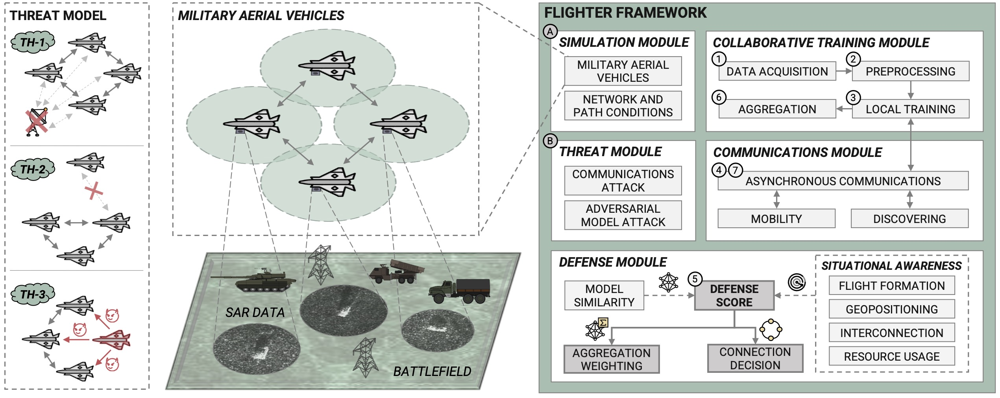

<br>
<p align="center">
  <h3 align="center">Flighter: Decentralized Federated Learning and Situational Awareness for Secure Military Aerial Reconnaissance</h3>
</p>
<br>

# 🌌 About Flighter

**Flighter** is a robust Decentralized Federated Learning framework for military aerial reconnaissance missions. This framework enables the decentralized training of federated models and integrates a defense module based on situational awareness. Flighter enhances the reconnaissance capabilities of aerial vehicles by assessing the reliability of each vehicle, ensuring accurate and resilient performance even under attack.

<p align="center">
  
</p>

## 📄 Abstract

> Mosaic warfare is a military strategy where reconnaissance missions with aerial vehicles are critical for gathering enemies information and achieving battlefield dominance. Nowadays, Machine Learning (ML) techniques play a pivotal role in this task by enabling precise identification of military vehicles. However, reconnaissance missions face challenges, particularly when enemies launch attacks targetting ML models and aerial exploration vehicles. Combining Decentralized Federated Learning (DFL) and situational awareness could improve these challenges by facilitating collaborative, context-aware, robust, and privacy-preserving ML-based learning processes. Nevertheless, existing literature overlooks this research field and its applicability to military reconnaissance missions. Thus, this work introduces Flighter, a novel framework for recognizing military vehicles by leveraging DFL and a defense module based on situational awareness. Flighter considers ML models similarity, flight formations, geopositioning, resource usage, and interconnection rate between aerial vehicles to mitigate adversarial attacks targeting reconnaissance tasks. A simulated military scenario using Synthetic Aperture Radar (SAR) data of military terrestrial vehicles has been deployed to evaluate the framework performance. The evaluation involved four simulated military aircraft operating in two flight formations under adversarial attacks affecting aircraft geopositioning and collaborative training module. Extensive experimentation with different attacks demonstrated that Flighter enhances literature detection accuracy and time.

## 📚 Citation

```
@article{MartinezBeltran:flighter:2024,
	title        = {{Flighter: Decentralized Federated Learning and Situational Awareness for Secure Military Aerial Reconnaissance}},
	author       = {Mart{\'i}nez Beltr{\'a}n, Enrique Tom{\'a}s and S{\'a}nchez S{\'a}nchez, Pedro Miguel and Bovet, G{\'e}r{\^o}me and Stiller, Burkhard and Mart{\'i}nez P{\'e}rez, Gregorio and Huertas Celdr{\'a}n, Alberto},
	year         = 2024,
	journal	  	 = {arXiv preprint arXiv:XXXX.XXXXX},
	preprint     = {https://arxiv.org/abs/XXXX.XXXXX}
}
```

## 📝 License

Distributed under the GNU GPLv3 License. See `LICENSE` for more information.