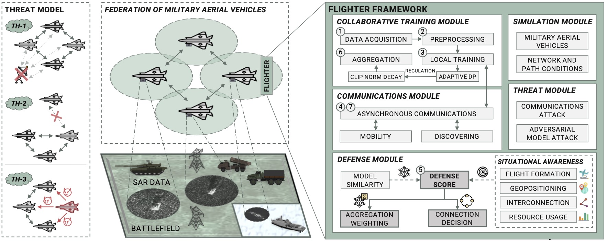

<br>
<p align="center">
  <h1 align="center">Flighter: Decentralized Federated Learning and Situational Awareness for Secure Military Aerial Reconnaissance</h1>
</p>
<br>

# 🌌 About Flighter

**Flighter** is a robust Decentralized Federated Learning (DFL) framework for military aerial reconnaissance missions. It integrates a situational-awareness-based defense module to ensure secure and decentralized training of federated models, effectively addressing the unique challenges of dynamic military environments. Moreover, it enhances model resilience by mitigating attacks while maintaining performance in adverse conditions.

<p align="center">
  
</p>

# 📄 Abstract

> Mosaic warfare is a military strategy where reconnaissance missions with aerial vehicles are critical for gathering enemy information and achieving battlefield dominance. Nowadays, Machine Learning (ML) techniques play a pivotal role in this task by enabling precise detection of military vehicles. However, reconnaissance missions face challenges, particularly when enemies launch attacks targetting ML models and aerial exploration vehicles. Combining Decentralized Federated Learning (DFL) and situational awareness could improve these challenges by facilitating collaborative, context-aware, robust, and privacy-preserving ML-based learning processes. Nevertheless, existing literature overlooks these research fields and their applicability to military reconnaissance missions. Thus, this work introduces Flighter, a novel framework that trains DFL models for enemy detection while safeguarding model integrity using a situational awareness-based defense module. Flighter considers model similarity, flight formations, geopositioning, resource usage, and interconnection rate between aerial vehicles to defend against adversarial attacks targeting reconnaissance tasks. A simulated military scenario using Synthetic Aperture Radar (SAR) data of military vehicles has been deployed to evaluate the framework performance. The evaluation involved four military aircraft operating in two flight formations under adversarial attacks affecting aircraft geopositioning and collaborative training. Extensive experimentation with different attacks demonstrated that Flighter enhances literature detection accuracy and time without compromising privacy.

# 📖 Additional Information

- **Authors**: Enrique Tomás Martínez Beltrán, Pedro Miguel Sánchez Sánchez, Gérôme Bovet, Burkhard Stiller, Gregorio Martínez Pérez, Alberto Huertas Celdrán
- **Datasets**: [DATASETS.md](DATASETS.md)
- **Models**: [MODELS.md](MODELS.md)
- **Internal Algorithms**: [ALGORITHMS.md](ALGORITHMS.md)

# 📚 Citation

```
@article{MartinezBeltran:flighter:2024,
	title        = {{Flighter: Decentralized Federated Learning and Situational Awareness for Secure Military Aerial Reconnaissance}},
	author       = {Mart{\'i}nez Beltr{\'a}n, Enrique Tom{\'a}s and S{\'a}nchez S{\'a}nchez, Pedro Miguel and Bovet, G{\'e}r{\^o}me and Stiller, Burkhard and Mart{\'i}nez P{\'e}rez, Gregorio and Huertas Celdr{\'a}n, Alberto},
	year         = 2024,
	journal	  	 = {},
	preprint     = {}
}
```

## 📝 License

Distributed under the GNU GPLv3 License. See `LICENSE` for more information.